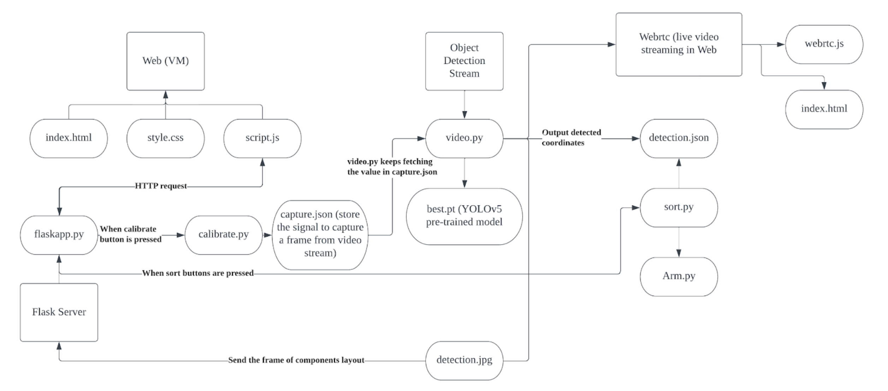
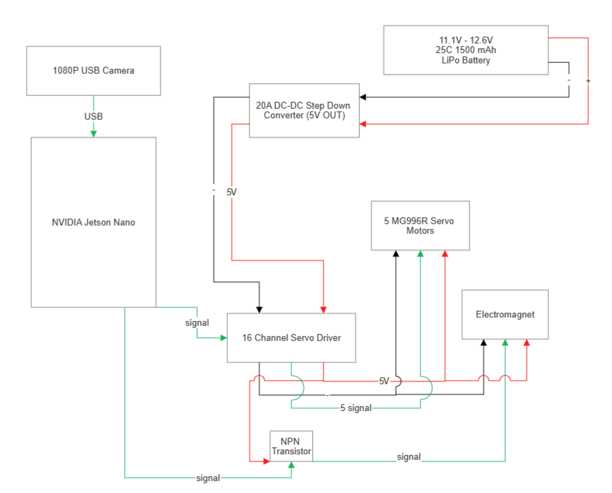

# Automated Robotic Sorting Arm

The Automated Robotic Sorting Arm is designed to detect, classify, and sort different objects based on their shape, size, and color using an AI-powered object detection system. It's controlled through a user-friendly web interface and provides live video feedback for monitoring and troubleshooting.

## Table of Contents
- [Features](#features)
- [Demo](#demo)
- [Motivation and Objectives](#motivation-and-objectives)
- [Open-ended Aspects](#open-ended-aspects)
- [Block Diagram](#block-diagram)
- [Contributors](#contributors)

## Features
- **Object Detection**: Detects and classifies objects based on their shape, size, and color.
- **Sorting**: Sorts objects into different boxes as per user preferences.
- **Robotic Arm Control**: Capable of a range of movements to pick up and sort various electronic components.
- **User Interface**: A web interface for user interaction.
- **Live Video Feed**: Provides real-time feedback of the arm’s operation for monitoring and troubleshooting.

## Demo
A demonstration of the Automated Robotic Sorting Arm in action can be viewed [here](https://drive.google.com/file/d/1gWUW9XUdtgkJqI4iZ9q6hy8NC1ioVPRM/view?usp=share_link).

## Motivation and Objectives
The project is inspired by the idea of creating an AI assistant akin to Jarvis from Iron Man, along with leveraging the capabilities of modern AI technologies. The key objectives include developing a reliable object detection algorithm, integrating it with the robotic arm, and designing a user-friendly interface for system control.

## Open-ended Aspects
- **Voice Control**: Exploration of voice control for enhanced user interaction.
- **Object Detection Optimization**: Expansion of object detection and sorting capabilities.
- **Sensor and Actuator Selection**: Exploration of better sensors and actuators for enhanced functionality and precision.

## Block Diagram

### Software

### Hardware

## Contributors
- Peter Ni
- Songli Du
- Wesley Chow
- Kevin Li
